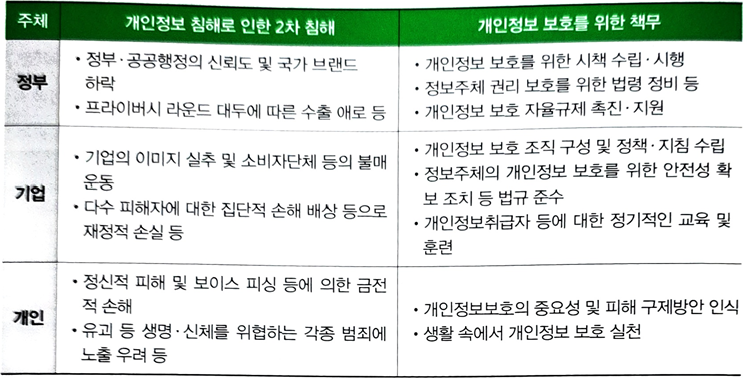
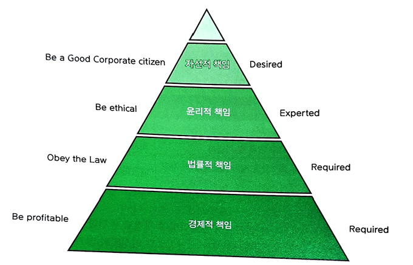

# PART 1-2 개인정보보호의 중요성

### 1. 정보화와 개인정보 등 사생활 노출
#### (1)정보화 사회 개인정보 침해
SNS는 사회 전반적으로 개인의 사생활 게재를 통해 주변인과의 커뮤니케이션, 정보 습득 및 교류 친교 및 교재, 홍보를 주목적으로 하고 있다. 개인정보는 신뢰적인 정보를 기반으로 하는 SNS에서는 더욱 유출될 위험이 크다. SNS는 자신의 개인정보를 공개함으로써 인적 네트워크를 구성하고 비교적 자유로운 정보를 공유할 수 있다. 이로 인해 SNS는 급속하게 성장하였으며, SNS를 활용하는 분야들 또한 증가하면서 SNS환경에서의 역기능도 점차 증가하고 있다.

    1)개인정보 침해 배경
    - 유비쿼터스 사회, 네트워크 기반 정보사회로 정보의 수집 및 유통이 쉬워짐->Digital
    - 개인정보의 자기결정 범위가 넒어진 만큼 사생활 침해의 위험성 또한 증가->Risk
    - 기술 발전으로 정보수집과 처리 능력이 향상되어 개인정보 침해 방법 다양화->Technology
    - 개인정보 수집과 침해에 대한 문제 의식 부족->Indiffenent

    2) 정보사회 개인정보 침해
    - 개인정보 노출: 일반 검색 엔진을 통해 노출되어 사생활 침해 문제 발생 가능
    - 개인정보 미파기: SNS 사으이 개인정보는 서비스 회원탈퇴 후에도 지속적으로 저장•공개 되므로 이용자의 개인정보 자기통제권 침해가 가능
    - 위치정보 노출: 스마트폰에서 제공하는 위치기반 SNS 등을 통해 개인위치 정보가 노출되어 절도 등 범죄에 악용 가능
    - 개인정보 탈취: 지능화된 피싱기법인 스피어피싱을 통해 계정정보 등 개인정보 탈취가 가능하고 이를 통해 개인에 대한 명예훼손 및 2차적 피싱에 악용 가능
    - 개인정보 도용: ID 도용을 통해 특정인 또는 기업의 프로파일을 위조하거나 해당 개인에 대한 명예훼손 또는 상품에 대한 비방이 가능

### 2. 개인정보 침해 유형
#### (1)개인정보 침해 원인
개인정보보호의 중요성에 대한 사회 전반적인 인식이 저조하다. 정보 주체가 자신의 정보의 사회적 가치에 대한 인식을 제대로 가지지 못해 개인정보 자기결정권을 행사하지 못하고 있고, 사업자의 사회적 책임이 부족하고 관련 법률에 대한 인식이 저조하다. 주민등록번호 수집이 관행화 되어있고, 개인정보보호 실천의지 부족으로 고충을 외면하거나 방치하는 경우가 있다. 또한 마케팅을 위한 불필요한 개인정보를 추가로 수집하고 있다. 마지막으로 개인정보처리자의 기술적•관리적 보호 조치가 미흡하다.

1)개인정보 침해 원인 및 이슈
|현황|원인|이슈|
|:--:|:--:|:--:|
|유출, 침해의 초 대량화|개인정보 대량 집적 추세로 유출사고 초 대량화(천만~억건)|전국민의 개인정보 유출 위험|
|개인정보 취급분야 확대|기존 정보통신산업에서 기타 산업분야, 비영리 단체 등으로 확대|다양한 분야에서 문제 발생 가능|
|새로운 기술 발달|스마트폰, 클라우드 컴퓨팅, CCTV, AI, 빅데이터 등|새로운 기술에 기반한 심각한 이슈 발생|
|정보주체의 인식 변화|집단소송, 분쟁조정, 침해신고 등 개인정보 침해에 적극적 대응|정보주체의 권리보장 요구 확대|
   
2)스팸 및 불법스팸
- 스팸: 정보통신망을 통해 수신자의 명시적인 사전 동의 없이 일방적으로 전송되는 영리목적의 광고성 정보
- 불법스팸: ⌈정보통신망 이용촉진 및 정보보호 등에 관한 법률⌋ 제50조의8의 규정을 위반하여 전송 또는 게시되는 영리목적의 광고성 정보로 불법스팸은 형사 처벌 및 과태료 부과의 대상이 됨
    
3)스팸의 문제점 및 정부 대책
|스팸 이슈화 원인|문제점|
|:--:|:--:|
|정보화 사회로 광고성 정보 전송 비용 저렴|전송량이 기하급수적으로 증가|
|수신자가 수신을 원하지 않음에도 불구하고 전송자가 무작위로 전송|수신자에게 불필요한 정보를 수신하게 하는 문제가 발생|
|이용자는 불필요한 정보를 확인•삭제•거부하기 위하여 시간을 낭비|스트레스를 받는 등 이용자 개인의 피해와 더불어, 필요한 광고성 정보의 전송으로 사회적 비용이 증가|
    ->정부대책
        - 스팸 전송을 차단하기 위하여 많은 정책을 만들고 법을 집행
        - 광고성 정보는 전송 단계에서 대응하는 것이 효과적

#### (2)개인정보 침해 유형
1)개인정보 행위별 침해 유형
|침해 유형|사례|
|:--:|:--:|
|부적절한 접근과 수집|해킹, 동의받지 않은 수집, 과도한 수집 등|
|부적절한 모니터링|고지하지 않은 CCTV 촬영, 쿠키 무단 수집|
|부적절한 분석|고지하지 않은 사적인 분석, 동의받지 않은 분석|
|부적절한 이전|고객에게 알리지 않고 타기업에 개인정보를 넘기는 행위|
|원하지 않은 영업 행위|스팸메일, 정크메일, 영리목적의 광고성 정보 전송|
|부적절한 저장|불안전한 개인정보 저장|

2)개인정보 생명주기별 침해 유형

수집
- 이용자의 동의 없는 개인정보 수집
- 과도한 개인정보 수집
- 민감한 개인정보 수집
- 관행적인 주민등록번호 수집

저장
- 개인정보의 기술적•관리적 조치 미비로 인한 개인정보 유출
- 외부인의 불법적인 접근에 의한 개인정보 유출 및 훼손
- 사업자의 인식 부족, 과실 등으로 인한 개인정보의 공유

이용 및 제공
- 고시, 명시한 범위를 벗어난 개인정보의 목적 외 이용
- 정보 주체의 동의없는 제3자 제공•공유

파기
- 정당한 이유없이 수집 목적 달성 후 미파기

3)개인정보 유출로 인한 2차 침해 유형
|현황|침해 유형|피해 유형|
|:--:|:--:|:--:|
|명의 도용|회원가입, 자격도용, 오프라인 서비스 명의 도용|다수 사이트에서 도용한 개인정보로 회원가입 가능|
|불법 유통 유포|개인정보 불법 유통, 인터넷 유포|영업점, 스팸발송업자, TM업자에게 판매하여 이용 가능|
|스팸 피싱|불법 스팸, 보이스 피싱|불법스팸, TM발송, 기관 사칭 전화 사기|
|금전적 이익 수칙|신분증 위조, 금융 범죄|전문가 위주 기술 필요, 추가 인증 시 도용 곤란|
|사생활 침해|사생활 정보 유출|개인 SNS 비공개 내용 유출 가능|

#### (3)개인정보 유노출
개인정보 유출은 정보주체의 개인정보에 대하여 개인정보처리자가 통제를 상실하거나 또는 권한 없는 자의 접근을 허용한 경우로 고의 또는 부주의에 기인한다. 개인정보 노출은 유출의 한 부분으로 홈페이지 이용자가 해킹 등 특별한 방법을 사용하지 않고, 인터넷을 이용하면서 타인의 개인정보를 취득할 수 있도록 인터넷 상에서 관련 '정보가 방치'된 상태로 주로 홈페이지 관리자 및 이용자의 부주의로 발생한다.

1)개인정보 노출, 유출 비교

#### (4)개인정보 보호의 필요성
1)개인정보 침해로 인한 2차 침해 및 주체별 책무

2)개인정보 피해구제 제도
- 개인정보침해 신고상담
    - 제도개선권고, 행정처분의뢰, 수사의뢰(개인정보보호법 제62조 근거)
    - 개인정보침해신고 센터 이용
- 개인정보분쟁조정
    - 제도개선권고, 손해배상권고(개인정보보호법 제43조 근거)
    - 개인정보분쟁조정위원회 이용
- 민사소송
    - 손해배상 청구(개인정보보호법 제39조 근거)

# PART 1-3 기업의 사회적 책임

### 1. 개인정보의 중요성 인식
개인정보는 전자상거래, 고객관리, 금융거래 등 사회의 구성, 유지, 발전을 위한 필수적인 요소로서 기능하고 있다. 특히 데이터경제 시대를 맞이하여 개인정보와 같은 데이터는 기업 및 기관의 입장에서도 부가가치를 창출할 수 있는 자산적 가치로서 높게 평가되고 있다.

#### (1)개인정보 가치 상승
1) 개인정보 수집 및 이용 동기와 효과

| |개인정보 수집 및 이용 동기|효과|
|:--:|:--:|:--:|
|고객 확보|소비자 마케팅|사업자가 고객으로 확보|
|고객 유지|고객 개인적 욕구 만족 및 차별화|맞춤형 서비스 제공으로 고객 충성도 제고|
|수요 파악|소비 트렌드 파악으로 적기 제품공급 및 재고 감소|매출과 이익 증대, 비용 절감|

2) 개인정보 영역 확대

    사회가 산업사회에서 정보사회를 넘어 4차 산업혁명의 시대로 발전함에 따라 개인정보의 범위와 영역이 확장되고 있다. 또, 산업사회에서 개인정보로 인정되지 않거나, 정보항목으로 존재하지 않던 것들이 점차 기술이 발전함에 따라 개인정보의 영역에 포함되고 있다. 또한 데이터경제 시대를 맞아 개인정보 등이 포함된 데이터의 중요성도 점차 증가하고 있다. 이처럼 개인정보는 '고정불변'의 개념으로 이해되기보다는 시대, 기술, 인식의 발전 및 변화에 따라 점차 확대되는 개념으로 볼 수 있다. 

### 2. 개인정보보호 조직 구성 및 운영
#### (1)기업의 사회적 책임(CSR)
CSR(Corporate Social Responsibility; 기업의 사회적 책임)이란 기업활동에 의해 영향을 받거나 영향을 주는 직•간접적인 이해관계자들에 대하여 발생 가능한 제반 이슈들에 대한 법적, 경제적, 윤리적 책임을 감당할 뿐 아니라, 기업의 리스크를 줄이고 기회를 포착하여 중장기적 기업가치를 제고할 수 있도록 추진하는 일련의 '이해관계자 기반 경영활동'이라고 할 수 있다.

1)기업의 사회적 책임(CSR) 정의
- The myth of CSR, Deborah Doane: 이익창출 및 이해관계자들의 수요에 부응하기 위해 규제에 순응하는 것 이상으로 기업이 노력하는 것
- OECD: 기업과 사회와의 공생관계를 성숙시키고 발전시키기 위해 기업이 취하는 행동
- WBCSD, 1998: 직원, 가족, 지역, 사회 및 사회전체와 협력해 지속가능한 발전에 기여하고 이들의 삶의 질을 향상시키고자 하는 기업의 의지
- Commission of the European commnities, 2001: 기업 스스로가 자신의 사업 활동을 행할 때나 이해관계자와의 상호관계에서 자발적으로 사회적 또는 환경적인 요소들을 함께 고려하는 것

2)기업의 사회적 책임(CSR) 단계

3)CSR로서의 개인정보보호
    
정보보호 관점에서 CSR을 생각해 보면, 고객의 개인정보 보호를 위해 많은 노력을 기울이는 기업 또한 중요한 사회적 책임을 하고 있다고 볼 수 있다. 그리고 CSR이 기업의 긍정적 이미지를 형성하는 중요한 경영요소라는 것을 고려했을 때, 고객의 개인정보 보호가 매우 중요한 기업의 경우, CSR을 정보보호 영역에 집중한다면 고객의 긍정적 이미지를 더욱 효과적으로 형성할 수 있을 것이다.
    개인정보보호 중심의 CSR -> 고객의 신뢰 형성 -> 서비스에 대한 긍정적 평가

#### (2)정보보호 조직 및 정보보호 거버넌스
정보보호 업무는 정보보호 조직과 비정보보호 조직이 협업하여 수행하는 전사 업무이다. 또한 정보보호 조직에서 전사적인 업무를 주도해 나가기 위해서 정보보호 인력에게 소통과 협업 역량이 필요하다는 접에 유의할 필요가 있다. 정보보호 위험은 기업 차원의 위험으로써, 이를 관리하는 정보보호 업무 역시 최고경영층이 관심을 갖고 전사적으로 지휘, 통제혜 나가야 하는 업무임에 틀림없다.

1)정보보호 업무와 정보보호 조직
|구분|(개인)정보보호 조직|비(개인)정보보호 조직|
|:--:|:--:|:--:|
|(개인)정보보호 업무|(개인)정보보호 관리체계, 보안기술, 보안이슈 대응|외주 보안, 입퇴사자 보안, IT인프라 운영 보안|
|비정보보호 업무|인사, 총무|영업, 마케팅, 개발, IT운영, 인사, 총무|

2)정보보호 거버넌스(ISO 27014) 프로세스
- 정보보 조직과 비정보보호 조직을 포함하여 실행 조직에서 정보보호와 관련된 정책, 사업, 조직 등에 관하여 제안한다.
- 최고경영층은 실행조직의 보고 내용을 검토, 평가한다.
- 최고경영층은 보고 내용을 시행할 필요가 있다고 판단하면, 이에 관란 전략, 정책을 실행조직에 지시한다.
- 최고경영층은 실행조직이 수행한 결과를 관찰하여 평가한다.
- 최고경영층은 보안 과제 또는 그것을 수행한 결과를 이해관계자와 소통한다.
- 최고경영층은 보안 활동이 잘 되고 있는지 객관적이고 전문적인 기관에 검토를 의뢰하고, 그 결과를 받아 검토한다.
- 실행조직은 최고경영층과의 소통과 보안업무를 수행하는 다른 조직의 협업을 통해 업무를 수행한다.

#### (3)(개인)정보보호 조직 구성
최고경영충은 조직과 인력, 예산에서 최종 의사결정자이다. 정보보호와 관련해서도 마찬가지다. 특히 경영진의 일원으로서 전사 보안 위험을 관리할 임원급 CISO의 임명과 적절한 권한을 부여하는 일은 무엇보다도 중요하다. 기업은 직위와 직책에 부여된 권한과 책임을 행사하는 계층 구조의 조직이기 때문이다. CISO조직의 업무에 걸맞은 조직과 인력을 구성해 주는 일 또한 최고경영충이 해야 할 중요한 정보보호 업무이다.

1) 최고경영층의 (개인)정보보호 역할

|최고경영층의 (개인)정보보호 역할|주요 활동|
|:--:|:--:|
|(개인)정보보호 조직 구성과 권한 부여|(임원급)CISO,CPO 임명과 권한 부여, (개인)정보보호 조직 구성 및 인력 지원|
|(개인)정보보호 사업계획 및 투자 승인, 지원|회사와 사업의 보안위험 완화, 경영목표와 연관된 보안위험 이해|
|전사 조직들과의 소통과 협업 지원|(개인)정보보호 조직과 라인조직의 협업 지원, 주기적인 전사 보안위험 커뮤니케이션|

2) 조직의 구성, 운영 방향

|조직 구성|운영 방향|
|:--:|:--:|
|법무조직 산하|개인정보보호 Compliance 초점, 해외 국가 법률적 전문지식 필요|
|CTO 산하|개인정보의 기술적 보호와 유노출 예방, 네트워크 보안, 데이터베이스 관리, 접근통제, 암호화|
|2개이상 기능조직의 가상조직(CISO 위시)|정책과 기술의 조화를 원하는 기업|

3) 개인정보보호 조직의 역할

|역할|설명|
|:--:|:--:|
|CISO 또는 CSO를 보좌하여 개인정보보호 합리적 보장|CEO의 의지를 CISO, CSO를 통해 확인하고, 실무부서에 전파, 통제하는 중간자 역할|
|개인정보보호 관련 법규제 준수 담보|개인정보보호법, 정보통신망 이용 촉진 및 정보보호 등에 관한 법률 등 준수, PIA, HIPPA, The Sarbanes-Oxley Act(SOA) 준수|
|개인정보보호 인식 향상|개인정보보호 인식 향상 교육, 워크숍, 포스터, 뉴스레터, Table Top Exercise|
|기타 개인정보보호 정책 수립 대외 활동|개인정보보호 세미나 참석, 관련 기관 동향 분석, 통신비밀보호업무 관련 형사소송법, 통신비밀보호법, 전기통신사업법 등 숙지 및 관련 수사기관 등 요청 응대, ISO27001, ISMS-P 등 국내외 인증 취득|

### 3. 개인정보보호 관련 국제표준
IS0 27701은 최초의 글로벌 개인정보보호 경영시스템 표준이다. ISO 27701은 ISO 27001의 확장 영역으로서 ISO 27701에는 PIMS(Privacy Information Management System: 개인정보보호 경영시스템)의 구축과 관련된 특정 요구사항, 목표 및 관리 수단이 포함된다. IS0 27701은 개인정보보호를 위한 중요한 단계로, 조직에 데이터 및 개인정보보호 행동 방법에 대한 실제 지침을 제공함으로써 기존의 규정을 충족한다. 이러한 지침을 통해 PI(개인식별정보)를 보호하면서 GDPR(유럽연합 개인정보보호법)과 같은 해당 규정을 준수할 수 있다.

#### (1) ISO/IEC 27701:2019
ISO/IEC 27701:2019는 국제 정보보호 표준 세트로 Information technology - Security techniques - Information security management systems - Requirements 로 구성되어 있다.

#### (2) 정보보호 및 개인정보보호 관련 인증